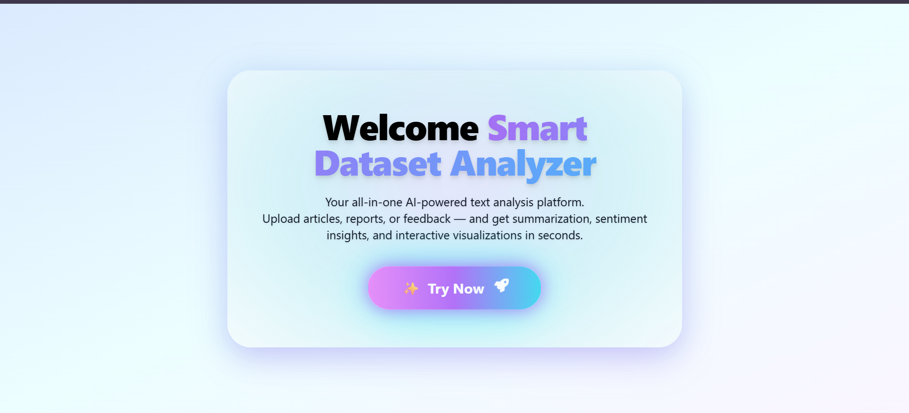
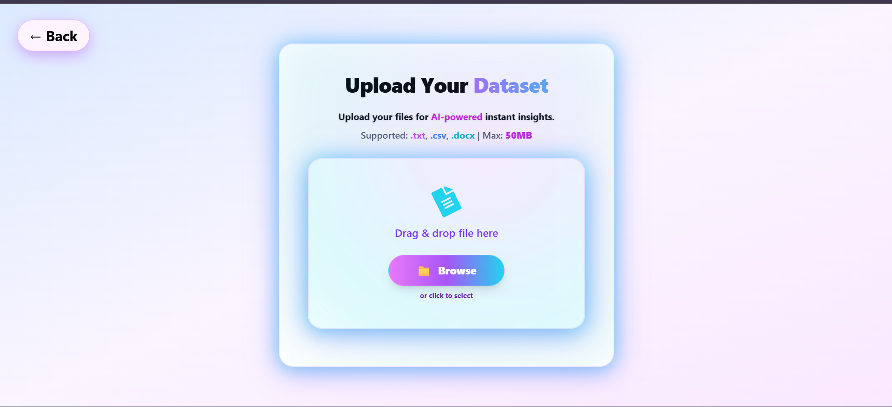
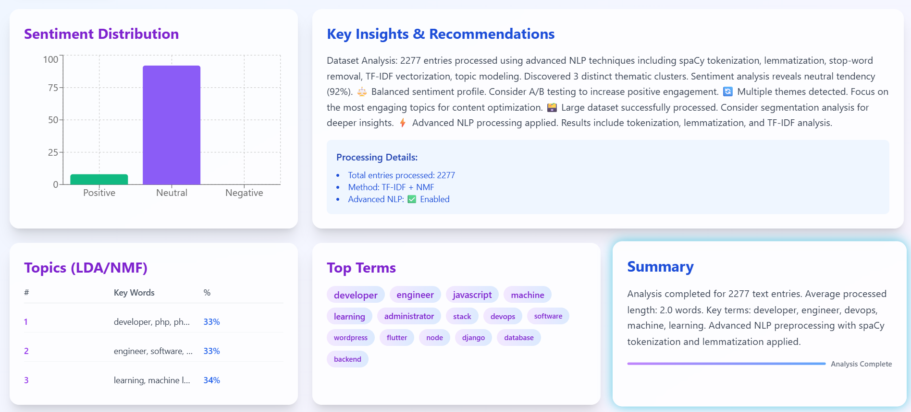

# 🚀 Smart Dataset Analyzer

**AI-powered text analysis platform** — upload `.txt`, `.csv`, or `.docx` files to instantly get **sentiment analysis**, **topic modeling**, **key terms**, and **downloadable PDF reports**.


---

## ✨ Features

- ✅ **spaCy-powered NLP** → tokenization, lemmatization, stop-word removal  
- ✅ **Sentiment Analysis** → Positive, Negative, Neutral breakdown  
- ✅ **Topic Modeling** → NMF (default) and LDA  
- ✅ **Top Terms Extraction** → for word clouds & quick insights  
- ✅ **Smart Recommendations** → based on dataset sentiment & topics  
- ✅ **PDF Report Export** → summary, insights, topics, and sentiment  

---

## 🖼️ UI Preview

<div align="center">
  
  
  
</div>

> ⚡ Place your actual screenshots in `frontend/public/assets/` with names `landing.png`, `upload.png`, `results.png`.

---

## 🛠️ Tech Stack

| Layer       | Technologies                                                                 |
|-------------|-------------------------------------------------------------------------------|
| **Backend** | FastAPI, spaCy, scikit-learn, pandas, TextBlob, ReportLab, FPDF              |
| **Frontend**| React, Tailwind CSS, Framer Motion, recharts, react-dropzone                 |
| **Reporting** | PDF generation with ReportLab + FPDF                                       |

---

## ⚡ Quick Start

### 1. Clone the Repository
```bash
git clone https://github.com/ssk-2003/Smart-Dataset-Analyzer.git
cd Smart-Dataset-Analyzer
